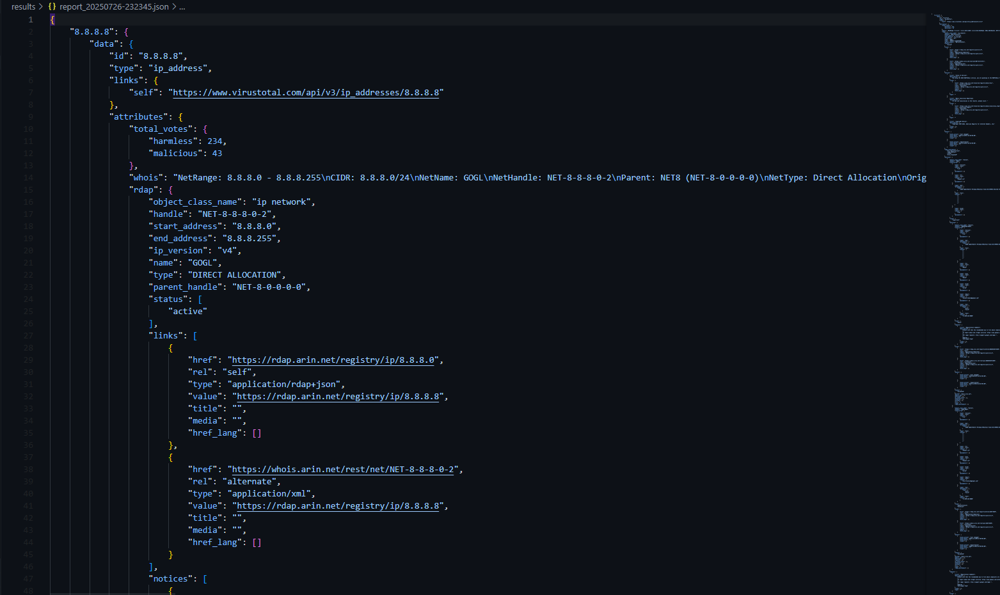

  <h1>Threat Hunter</h1>
  <p>A simple yet effective threat hunting tool for Windows.</p>

  <p>
    <a href="https://github.com/Kaawasaaki/Threat-Hunter/stargazers"></a>
    <a href="https://github.com/Kaawasaaki/Threat-Hunter/network/members"></a>
    
    
  </p>
</div>

---

**Threat Hunter** is a Python-based tool designed for Windows systems to help security analysts, incident responders, and system administrators quickly identify suspicious activities. It scans for common persistence mechanisms and indicators of compromise, providing a clear, tabulated output for easy analysis.

This tool is perfect for initial triage on a potentially compromised machine to gather quick intelligence.

##  Key Features

Threat Hunter automates the search for anomalies across various parts of the Windows operating system.

*   **Suspicious Processes**: Identifies running processes that are not signed by Microsoft.
*   **Third-Party Services**: Lists running services that are not part of the core Microsoft operating system.
*   **Non-System Scheduled Tasks**: Finds scheduled tasks created by users or applications, filtering out default system tasks.
*   **Startup Programs**: Scans common registry run keys (`HKLM`, `HKCU`) for programs configured to launch at startup.
*   **Active Network Connections**: Shows all established TCP connections and the processes that own them.
*   **Recently Accessed Files**: Lists files recently opened by the user, which can help trace an attacker's activity.
*   **Failed Logon Attempts**: Scans the Windows Security Event Log for failed logon attempts (Event ID 4625), a common sign of brute-force attacks.

## Screenshot

(


## Prerequisites

Before you begin, ensure you have the following on your Windows machine:

*   **Windows Operating System**: This tool is designed exclusively for Windows.
*   **Python 3.x**: Make sure Python 3 is installed and added to your system's PATH.
*   **Administrative Privileges**: The script requires administrative rights to access system information like services, event logs, and all running processes.

##  Installation

1.  **Clone the repository:**
    ```sh
    git clone https://github.com/Kaawasaaki/Threat-Hunter.git
    ```

2.  **Navigate to the project directory:**
    ```sh
    cd Threat-Hunter
    ```

3.  **Install the required Python packages:**
    ```sh
    pip install -r requirements.txt
    ```
    The key dependencies are `psutil`, `WMI`, `pywin32`, and `tabulate`.

## 🖥Usage

You must run the script from a command prompt or PowerShell with **Administrator privileges**.

<br>

▶ **To run all checks at once:**

This is the recommended way to get a full system overview.

```sh
python Threat_Hunter.py --check-all
